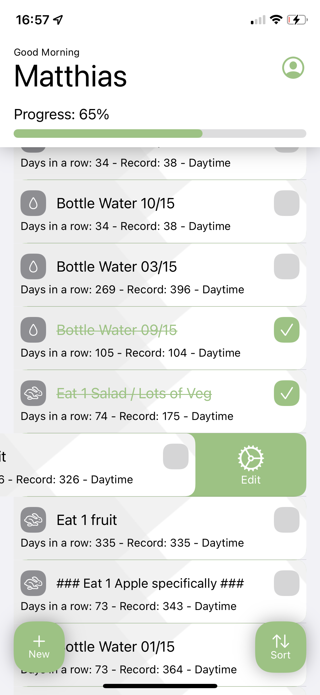
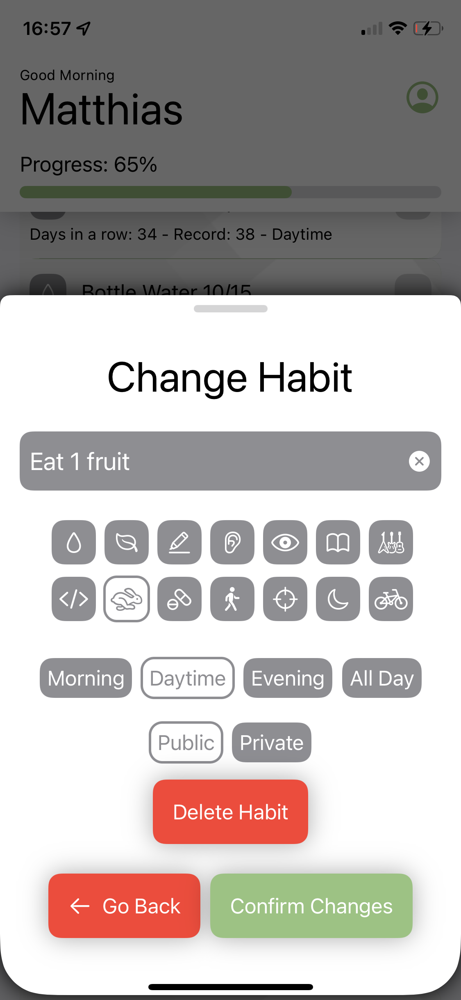
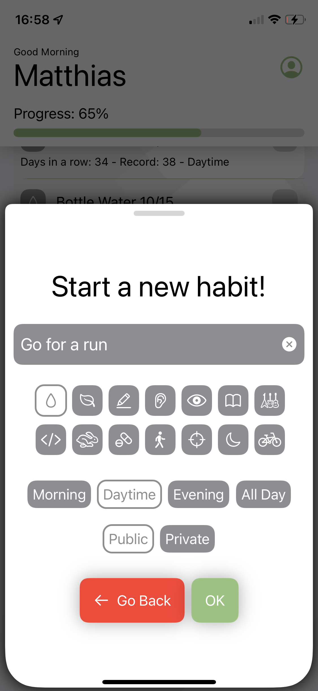
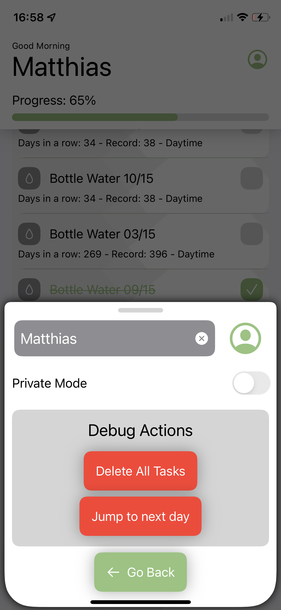

# Your Daily Habits

    

App in SwiftUI that records your daily habits, creates a daily todo-list, and resets it each day.

### Features:
- Create a list of tasks that can be check off
- Done tasks are sorted to the bottom
- Todo tasks are sorted by time of day
- Every day the list resets
- Every task's streak is counted
- When a task is not done the streak is reset to zero
- Progress Bar

### Todo:
- Weekly Tasks
- User Icon Upload
- User Name setting

Tilable Backgrounds created with:
- https://patternizer.com/
- http://www.stripegenerator.com
